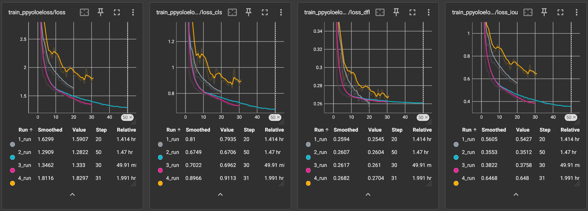

# YOLO NAS Head detection

Object detection project using YOLO NAS and the [MOTChallenge Head Tracking 21 dataset (HT21)](https://motchallenge.net/data/Head_Tracking_21/) for training a model to be able to detect human heads in drone footage from the following [Keggle dataset](https://www.kaggle.com/datasets/kmader/drone-videos/data?select=Isles+of+Glencoe.mp4). The challenge was not using any drone footage in the training data.

###
## Data Acquisition and Generation Methodology

### 1. Initial dataset

The first hurdle training YOLO NAS on the given dataset is that the  [HT21 dataset](https://motchallenge.net/data/Head_Tracking_21/) is not annotated in the YOLO format. To fix the annotations I wrote the [converter.py](/converter.py) script and used it to convert all labels to the appropriate format. The files were split 5:1 between training and validation data.

### I will make sure to include a zip file with the original data annotated for YOLO NAS here.
HT21 in YOLO NAS/YOLOv8 annotation (Yolo Nas Head Tracking): [YN-HT](https://drive.google.com/file/d/1Tk5zNn7kOdbJ25Y2EZ6GvVbuMLXKIrTK/view?usp=sharing)

1/10 HT21 in YOLO NAS/YOLOv8 annotation (Yolo Nas Head Tracking small): [YN-HT-s](https://drive.google.com/file/d/1Oar6HXmx9K-rnC0_1VgVXRLENhrUWQDH/view?usp=sharing)

### 2. Test dataset

For the test dataset I extracted images from the given videos using [frame_extractor.py](/frame_extractor.py). I took the best images and annotated them by hand in [Roboflow](https://roboflow.com/), and exported it in the shared YOLOv8 annotation format.

### 3. Null data

To ensure less false positives I made sure to include 5% data containing no heads. This was mostly generated by taking random frames from random YouTube videos of nature again using [frame_extractor.py](/frame_extractor.py). Empty labels were created for the newly generated images with [converter.py](/converter.py).

### 4. Augmentation and Transformation

YOLO NAS has built in tools that transform the given training and validation data which I will be discussing below in more detail.

###
## Training Methodology

Training is defined inside [detector.py](/detector.py) along some tools used for checking annotation validity.

I have defined input dimensions as 1920x1088, or (60x32, 34x32). This was done because all the images were in 1920x1080 resolution but the trainer requires all inputs to be divisible by 32. 

Because of hardware limitations I opted for using 1/10th of the training and validation data as I otherwise would not have had time to test multiple configurations. Originally, running the training locally would have taken at least 30 hours for 20 epochs. This was reduced to 1.5 hours for 30 epochs.

In ***model_training()*** we define training data and validation data. Both of them will use a batch size of 2 with 4 workers due to limitations of memory to be able to handle such big input images (was trained on a 12GB 4070ti).

### After testing these were the parameters with the best results.
Training data is transformed with the following  parameters:
```py
[{'DetectionMosaic': {'input_dim': [1920, 1088], 'prob': 1.0}},
{'DetectionRandomAffine': {'degrees': 10.0, 'translate': 0.1, 'scales': [0.1, 2], 'shear': 2.0, 'target_size': [1920, 1088], 'filter_box_candidates': True, 'wh_thr': 2, 'area_thr': 0.1, 'ar_thr': 20}}, 
{'DetectionMixup': {'input_dim': [1920, 1088], 'mixup_scale': [0.5, 1.5], 'prob': 1.0, 'flip_prob': 0.5}}, 
{'DetectionHSV': {'prob': 1.0, 'hgain': 5, 'sgain': 30, 'vgain': 30}},
{'DetectionHorizontalFlip': {'prob': 0.5}}, 
{'DetectionPaddedRescale': {'input_dim': [1920, 1088]}}, 
{'DetectionTargetsFormatTransform': {'input_dim': [1920, 1088], 'output_format': 'LABEL_CXCYWH'}}]
```
DetectionMixup is included by default so we pop it out of the transforms list as it is a bad transform for small object detection.
```py
train_data.dataset.transforms.pop(2)
```

The validation data is transformed with the following parameters:
```py
[DetectionPaddedRescale('additional_samples_count': 0, 'non_empty_targets': False, 'swap': (2, 0, 1), 'input_dim': (1920, 1088), 'pad_value': 114),
DetectionTargetsFormatTransform('additional_samples_count': 0, 'non_empty_targets': False, 'input_format': OrderedDict([('bboxes', name=bboxes length=4 format=<super_gradients.training.datasets.data_formats.bbox_formats.xyxy.XYXYCoordinateFormat object at 0x000002874700BD30>), ('labels', name=labels length=1)]), 'output_format': OrderedDict([('labels', name=labels length=1), ('bboxes', name=bboxes length=4 format=<super_gradients.training.datasets.data_formats.bbox_formats.cxcywh.CXCYWHCoordinateFormat object at 0x0000028747039AF0>)]), 'min_bbox_edge_size': 1, 'input_dim': (1920, 1088), 'targets_format_converter': <super_gradients.training.datasets.data_formats.format_converter.ConcatenatedTensorFormatConverter object at 0x000002874A4A74C0>)]
```

The training parameters are:
```py
train_params = {
    'silent_mode': False,
    "average_best_models": True,
    "warmup_mode": "LinearEpochLRWarmup",
    "warmup_initial_lr": 1e-6,
    "lr_warmup_epochs": 3,
    "initial_lr": 5e-4,
    "lr_mode": "cosine",
    "cosine_final_lr_ratio": 0.1,
    "optimizer": "AdamW",
    "optimizer_params": {"weight_decay": 0.0001},
    "zero_weight_decay_on_bias_and_bn": True,
    "ema": True,
    "ema_params": {"decay": 0.9, "decay_type": "threshold"},
    "max_epochs": EPOCHS,
    "mixed_precision": True,
    "loss": PPYoloELoss(
        use_static_assigner=False,
        num_classes=len(dataset_params['classes']),
        reg_max=16
    ),
    "valid_metrics_list": [
        DetectionMetrics_050(
            score_thres=0.1,
            top_k_predictions=300,
            num_cls=len(dataset_params['classes']),
            normalize_targets=True,
            post_prediction_callback=PPYoloEPostPredictionCallback(
                score_threshold=0.01,
                nms_top_k=1000,
                max_predictions=300,
                nms_threshold=0.7
            )
        ),
        DetectionMetrics_050_095(
            score_thres=0.1,
            top_k_predictions=300,
            num_cls=len(dataset_params['classes']),
            normalize_targets=True,
            post_prediction_callback=PPYoloEPostPredictionCallback(
                score_threshold=0.01,
                nms_top_k=1000,
                max_predictions=300,
                nms_threshold=0.7
            )
        )
    ],
    "metric_to_watch": 'mAP@0.50:0.95'
}
```

### Checkpoints

The checkpoints are stored in the [checkpoints directory](/checkpoints/yolo_nas_s) separated into models trained (only yolo_nas_s due to time restraints). You can download the folder and run *tensorboard* to visualize the data.
```commandline
tensorboard --logdir checkpoints/yolo_nas_s
```

### Log analysis

We see good difference between the runs in the training logs through tensorboard.

<p align="center">
  
</p>

By these statistics the 4th run should be the worst performing model among the 4 models trained as its loss is the highest. Although the low loss of the other runs could be signs of overfitting. For more insight we should look at the validation logs.

<p align="center">
  
</p>

These are very unusual and unorthodox and thus very hard to decipher as I have no professional experience in Data Science. The first 2 loss graphs have strange spikes up to 20,000 and come back to more conventional values. 

The third and forth graph produced a more standard asymptotic curve for all but the 2nd run. 

The 2nd run starts by seemingly oscillating before diving around the 15 epoch mark and reaching its lowest point between 25 and 30 epoch, before jumping back to its oscillating value and slowly rising. I took this to mean that the loss dropped when the neural network was generalized successfully and it spiked back up once overfitting took place.

###
## Test results

Download the models with all tensorboard logs [here](https://drive.google.com/file/d/1pPCtFBijCVjeKMAYpUk8eA4XEhgcxMVY/view?usp=sharing)

Download the test results on video [here](https://drive.google.com/file/d/11MGdQRMPROyrKPjvmALF7TM34S50jRlJ/view?usp=sharing)

To see run comparisons on images go to the [results directory](/results).

In the videos I will only show detections with 50% probability as showing lower percentages gives a lot of false positives.

### Jog-No null data.mp4
- ***checkpoints/yolo_nas_s/1_run/ckpt_best.pth***
- Default transform configuration as provided by YOLO NAS
- No Null data
- 20 epochs
- Training time circa 1:30h

Head detection flickers in and out but is always very accurate. Model shows true positive detection between 50-65% probability range. No false positives.

### Jog-Different Transforms 50epoch.mp4
- ***checkpoints/yolo_nas_s/2_run/ckpt_best.pth***
- Transform configuration heavily changed from default
- No Null data
- 30 epochs
- Training time circa 3h

Heads almost never detected correctly and sometimes people are mistaken for heads. A lot of false positives in the right top and bottom corners. On the Validation loss graphs the loss drops around the 25th epoch and starts rising after the 30th from overfitting. 

Going forward I trained only up to 30 epochs.

### Jog-Different Transforms 30epoch.mp4
- ***checkpoints/yolo_nas_s/3_run/ckpt_best.pth***
- Transform configuration slightly tweaked from previous
- Null data added
- 30 epochs
- Training time circa 1h
 
Null data was added to prevent random patterns becoming false positives.

Null data was very successful in stopping false positives on the edges of the screen. On the loss graphs we see that overfitting was prevented by limiting training to 30 epochs.
Model performance suboptimal. Rarely tracks the heads with 50%+ probability, but when it tracks it is always correct.

### Jog-best.mp4
- ***checkpoints/yolo_nas_s/4_run/ckpt_best.pth***
- Modified default transform configuration as provided by YOLO NAS
- Null data added
- 30 epochs
- Training time circa 1:30h

Transform was turned back to default and slightly tweaked by removing some default transforms and slightly editing others.
Model performance was optimal. The heads were tracked during the majority of the video and consistently staying within the 60-80% range.

###
## Thoughts

The slow training speed caused by opting to use the original resolution used a lot of time that I feel was worth it for the sake of better detecting small objects.
In the future if it was possible I might try to crop the input images into 4 equally sized images. This would also be a viable strategy to train the current model with 4K images.

However, my instance on using such big input dimensions prevented me from running as many different configurations as I would have liked to or added as much training data as I feel necessary.

###  Theoretical next steps

Next steps for this project would be gathering, generating and adding more diverse datasets to the training pool, optimizing the test parameters and training data transforms and using the larger YOLO-NAS-L model for the best performance. All of this should be done on AWS or Google servers to be sped up as training it locally seems untenable.

For data generation I would use the current top preforming model to automatically annotate more datasets with diverse picture angles and backgrounds. If finding additional data becomes an issue, I would also consider generating some artificial data using generative diffusion models like DALL-E.
